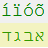

<h1> NoGibbrish.JS</h1>

A NodeJS script (no dependencies but need to have node.exe on your PC),  
to fix gibbrish characters into Hebrew ones.

Simply this gist:  
https://gist.github.com/eladkarako/a8a36c82967d12dc0923985a560089ea#file-gibberish_to_hebrew-js  
but with a cmd to run it and some examples taken from:  
https://github.com/eladkarako/Dictionaries/blob/content/Babylon_English_Hebrew.7z  

Works quite fast.

The <code>/resources</code> folder contains <code>gibberish_to_hebrew.php</code>,  
which works in a similar way, with the additional force of encoding  
(and commented out are some of my early tryouts for fixing an encoding-issues..)  
You still need to wrap things out a bit, (providing the textual content, with an input/form or a file, such as with 'fopen').